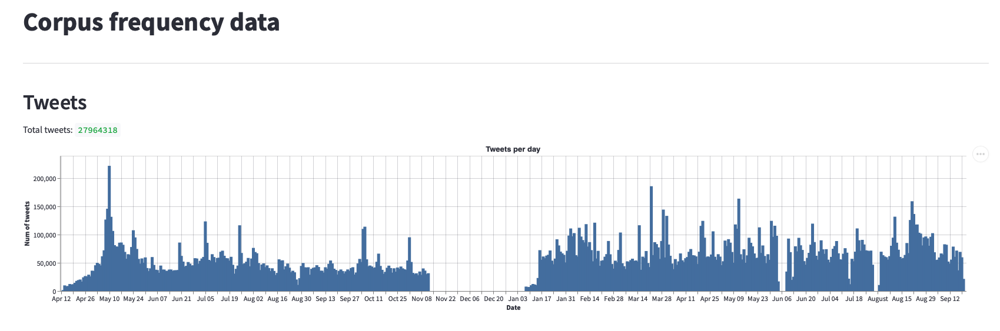

# Covid Rumours in Historical Context
## Corpus of COVID-19 tweets
*School of Advanced Study, University of London, 2020-2022*

**Project website:** https://historyandrumour.blogs.sas.ac.uk

**History & Policy paper:** *Covid Rumours in Historical Context - Two Policymaking Paradigms*, Professor Jo Fox, Dr David Coast, Jacob Forward. 21 February 2022 https://www.historyandpolicy.org/policy-papers/papers/covid-rumours-in-historical-context-two-policymaking-paradigms

### The project repositories

This dataset was collected for the AHRC funded research project 'COVID-19 rumours in historical context' (Grant Ref: AH/V012762/1). The project's digital outputs have been published in three repositories:

1. [covid-rumours](https://github.com/SAS-DHRH/covid-rumours): Used for the data analysis, taxonomy and classifier modelling.
2. covid-rumours-data (this repository): The complete tweet corpus.
3. [covid-rumours-dashboard](https://github.com/SAS-DHRH/covid-rumours-dashboard): The prototype dashboard for exploring diachronic semantic fields, in the data.

*For more info about each of these see their respective README.md files.*

This collection of 3 project repositories link together the digital academic outputs of the AHRC funded project, including source code (working and not-working), raw data references, derivative and anonymous datasets, visualisation and data exploration prototype dashboard, annotated tweet data, classifier pipelines, taxonomies of rumour and technical and methodological documentation.

### The data

In this repository the original tweet corpus is kept and contains almost 2 years of tweets harvested daily (576 jsonl.gz files). The total number of tweets in the corpus is 34,590,486, the number of unique users in the corpus is 7,542,484 and the number of unique hashtags in the corpus is 614,464. Anonymised derivative data (hashtags, users, daily tweet counts, etc.) have been produced and are available in this repository. (The linguistic data (n-grams and machine learning training data) were processed in the covid-rumours repository.) The complete Twarc log files are also included in this data package.



*Histogram of tweet frequencies (and missing data) in the covid-rumours-data corpus*

Data was collected from the [Twitter API](https://developer.twitter.com/en/docs) using [Twarc](https://github.com/DocNow/twarc) from 21 April 2020 through to 11 January 2022 in three batches:

1. rona-rumours-corpus-ᾱ (alpha) was collected from 2020-04-13 through 2020-11-12,
2. rona-rumours-corpus-β (beta) was collected from 2021-01-08 through 2021-09-20,
3. rona-rumours-corpus-γ (gamma) was collected from 2021-09-20 through 2022-01-10.

Directory structure is:

```
./data - the original daily JSONL tweets
./logs - the Twarc harvester daily log files
./phase - attrition data showing deleted/protected/blocked status of the corpus
./bin - opensource code libraries used (twarc)
./scripts - scripts used data analysis and processing
./build - the built (derivative) data, intented to be used in downstream processes
```

Due to privacy and distribution reasons (large data) the original twitter data (and most of the build data) is not directly contained within this git repository, but rather version controlled, integrity hashed and stored separately in a private secure data enclave. The `.dvc` text files represent these private files.


#### Hashtags followed

The Twitter hastags were determined by the project research team in April 2020.

We attempted to keep the hastags the same for the entire duration of the project's data collection and as consistently as possible used the following hashtags:

*5g, AdvancedMedicine, agenda2020, agenda21, antivaccine, bioweapon, boycottqantas, cornaviruscoverup, coronabollocks, coronahoax, coronavirusliar, coronavirustruth, covidiot, covidiots, depopulation, depopulationagenda, DrRashidAButtar, endlockdown, endthelockdownuk, event201, fakepandemic, filmyourhospital, foodshortages, forcedvaccines, idonotconsent, medicalfreedom, mybodymychoice, newworldordervirus, OR vaccineskill, plandemic, plandemicdocumentary, PlandemicDocumentary, plannedemic, reopenuk, scamdemic, stayathomecowards, stop5g, stopmandatoryvaccination, syringeslaughter, TOF, tof, TruthOrFacts, vaccineagenda, vaccineinjury, vaccineskill, WeChangeTheWorld, wewillnotcomply*

However, there was a few changes over the collection period. Our API access was blocked by Twitter at the end of 2020 and reinstated in early 2021 and we lost power a couple of times and had to restart the Raspberry Pi which was doing the harvesting. When we restarted some hashtags were blocked and we had to diagnose which ones and omit them. The following tags had to be removed at some point and so were only partially collected:

*AdvancedMedicine, bioweapon, covidiots, DrRashidAButtar, plandemic, plandemicdocumentary, PlandemicDocumentary, TOF, tof, TruthOrFacts, WeChangeTheWorld, antivaccine, boycottqantas, idonotconsent, medicalf§reedom, mybodymychoice, stop5g, stopmandatoryvaccination, syringeslaughter, vaccineinjury, vaccineskill*


#### Missing data

There are some missing days in the time series, which correspond to blocked Twitter API access over xmas 2020/21. A few other weekends and days were lost during 2021 because of electricity and internet outages. The daily and hourly tweet count csv files in the `./build` folder will give you enough detail of the quantities and temporal coverage of this corpus.


#### Version control and sensitive data

The built data is generated from the original Tweet JSONL data using the `Makefile`. The Makefile contains the scripts and commands to do the data processing. Much of the built data still contains usernames or other senstitive information, another reason why we store these data in a secure non-public version controlled location using [Data Version Control - dvc](https://dvc.org/).

There are some files which are not sensitive and not too huge and thus included in this repository directly. These files have been added to this git repository and if you clone this repository you will get those files. They are:

```
./build/languages-count.txt
./build/sensitive-count.txt
./build/tids-count.txt
./build/tweets-daily.csv
./build/tweets-hourly.csv
./build/tweets-retweeted-daily.csv
./build/tweets-retweeted-hourly.csv
./build/users-daily.csv
```

**Note:** Twitter permits us to share the tweet ID's, because we are a not-for profit academic research project, however, due to the size of this file (1.7GB uncompressed, 353MB compressed) it is not included in this git repository but it has been manually added to github. [You can download it from the releases here](https://github.com/SAS-DHRH/covid-rumours-data/releases).

#### Data harvesting

The twarc command was used to harvest the data, and this ran on a Raspberry Pi 3 B+ in a background process. The command was:

```
twarc filter '5g,agenda2020,agenda21,antivaccine,boycottqantas,cornaviruscoverup,coronabollocks,coronahoax,coronavirusliar,coronavirustruth,covidiot,depopulation,depopulationagenda,endlockdown,endthelockdownuk,event201,fakepandemic,filmyourhospital,foodshortages,forcedvaccines,idonotconsent,medicalfreedom,mybodymychoice,newworldordervirus,plannedemic,reopenuk,scamdemic,stayathomecowards,stop5g,stopmandatoryvaccination,syringeslaughter,vaccineagenda,vaccineinjury,vaccineskill,wewillnotcomply' >> data/all-filter.jsonl &
```

The `all-filter.jsonl` file and the `twarc.log` file were be created and a logfile daily rotation was used to shift the data into the `./data` and `./logs` directories respectively. The `./logrotate.conf` file contains config used. A daily crontab entry was added to rotate the data at 01:00 each morning:

```
0 1 * * * /usr/sbin/logrotate -s /home/pi/rona-rumours-corpus-beta/logrotate.status /home/pi/rona-rumours-corpus-beta/logrotate.conf > /dev/null 2>&1
```

It's a bit piecemeal, but it worked. One side effect however was each night during file rotation the first and last lines of JSON were usually split in two, leaving partial/invalid JSON, so a procedure of tidying and validating the data (to make it usable in in the Makefile) was performed. See the `./notes/source-data-chunking.md` for more details about that procedure.

#### Setup of repo and data version control

These commands built the repo:

```
git init
dvc init
dvc remote add -d marjory ssh://marjory/home/dvcremotes
dvc add data/*.jsonl.gz
dvc add logs/*.log.zip
git add .
git commit -m 'initial commit'
dvc push
git remote add origin git@ssh.github.com:/sas-dhrh/covid-rumours-data
git push -u origin --all
```

The following command will pull a local copy of the corpus data from the secure enclave. It is approximately 60GB in size (including built/derivative data). This comand is here for info. We unfortunately can't distribute the raw data publically:

```
cd covid-rumours-data
dvc pull
```


### Data License

The data is subject to [Twitter's terms of service](https://twitter.com/en/tos); to [Twitter's developer agreement and policy](https://developer.twitter.com/en/developer-terms/agreement-and-policy); and to [Twitter's advice on restricted use cases](https://developer.twitter.com/en/developer-terms/more-on-restricted-use-cases)

This is a not for profit Academic Research project, and so we are allowed to publically disseminate the tweet ids. See [Redistribution of Twitter content](https://developer.twitter.com/en/developer-terms/more-on-restricted-use-cases) for more info.


### About the School of Advanced Study

Please also see the [School of Advanced Study's Institutional Repository](https://sas-space.sas.ac.uk) if you would like to find other publically available project data, or contact [the School](https://sas-space.sas.ac.uk/contact/) if you would like to request access to other research material.

---

*MS & KK*\
*Digital Humanities Research Hub (DHRH), School of Advanced Study (SAS)*\
*University of London, 2021-22*

---
