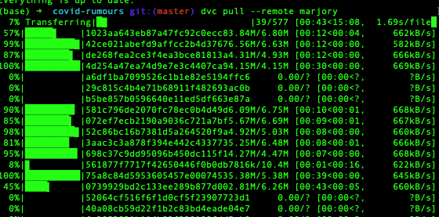

# Covid Rumours in Historical Context

[Covid Rumours in Historical Context](https://historyandrumour.blogs.sas.ac.uk), funded by UKRI's Arts and Humanities Research Council (AHRC Grant Ref: AH/V012762/1).

This project examined the pandemic of rumour and of disinformation that has accompanied the COVID-19 outbreak in the UK. It took a historical perspective, analysing how and why similar rumours have spread in the past, how previous governments have responded to them, and evaluating how successful these efforts were. The study tracked the language of rumours (via international English language Twitter data) relating to the COVID-19 pandemic and vaccination programme, and compared them to historical precedents.

**Project team**

Professor Jo Fox (PI, School of Advanced Study, University of London), Dr David Coast (Co-I, Bath Spa University), Professor James Smith (Co-I, Durham University), Martin Steer (Co-I, Digital Humanitites Research Hub, School of Advanced Study, University of London), Kunika Kono (Digital Humanitites Research Hub, School of Advanced Study), Jacob Forward (History & Policy, Insititute of Historical Research), Richard Williams (ITDS, University of London).

Thankyou to Sam Sakabuth (Wordpress setup and management) and Gemma Dormer (Events coordination and planning) for their help and support throughout the project.

**Publications**

Fox, Jo, David Coast, and Jacob Forward, "[Covid Rumours in Historical Context - Two Policymaking Paradigms](https://www.historyandpolicy.org/policy-papers/papers/covid-rumours-in-historical-context-two-policymaking-paradigms)", *History & Policy*, 2022

Forward, Jacob, Jo Fox, David Coast, James Smith, and Martin Steer, "[Data Workshop Report](https://historyandrumour.blogs.sas.ac.uk/data-workshop-report)", *History & Policy*, 2021

Fox, Jo, David Coast, James Smith, and Martin Steer, "[COVID-19 rumours in historical context](https://pandemicandbeyond.exeter.ac.uk/wp-content/uploads/2022/03/Rumours_Fox_PolicyBrief_Nov21.pdf)", *The Pandemic and Beyond*, 2021


<br />

## Project repositories

The project's digital outputs have been published in three repositories:
1. covid-rumours (to be released): Used for the data analysis, taxonomy and classifier modelling.
1. covid-rumours-data (this repository): Derivative data from the tweet corpus.
1. [covid-rumours-dashboard](https://github.com/SAS-DHRH/covid-rumours-dashboard): The dashboard for exploring diachronic semantic fields in the data.

For more information about each of these repositories, please see their respective README files.

This collection of 3 repositories link together the digital outputs of this project, including source code (working and not-working), raw data references, derivative and anonymous datasets, visualisation and data exploration dashboard, annotated tweet data, classifier pipelines, taxonomies of rumour and technical and methodological documentation.


<br />

## About the Data

In this repository the original tweet corpus is kept and contains almost 2 years of tweets harvested daily (576 jsonl.gz files). The total number of tweets in the corpus is 34,590,486, the number of unique users in the corpus is 7,542,484. Anonymised derivative data have been produced and are available in this repository.


*Screenshot of the about dashboard page, contains summaries of tweet frequencies (and missing data) in the covid-rumours-data corpus*


Data was collected from the [Twitter API](https://developer.twitter.com/en/docs) using [Twarc](https://github.com/DocNow/twarc) from 21 April 2020 through to 11 January 2022 in three batches:

1. rona-rumours-corpus-ᾱ (alpha) was collected from 2020-04-13 through 2020-11-12,
2. rona-rumours-corpus-β (beta) was collected from 2021-01-08 through 2021-09-20,
3. rona-rumours-corpus-γ (gamma) was collected from 2021-09-20 through 2022-01-10.

The complete Twarc log files are also included in this data package.

**Missing data**

There are some missing days in the time series, which correspond to Twitter API access problems over xmas 2020/21 and a few other weekends and days were lost during 2021 because of electricity and internet outages. The daily and hourly tweet count csv files in the `./build` folder provide enough detail of the quantities and temporal coverage of this corpus.

### Hashtags

The Twitter hastags were determined by the project research team in April 2020. We attempted to keep the hastags the same for the entire duration of the project's data collection and as consistently as possible used the following hashtags:

> *5g, AdvancedMedicine, agenda2020, agenda21, antivaccine, bioweapon, boycottqantas, cornaviruscoverup, coronabollocks, coronahoax, coronavirusliar, coronavirustruth, covidiot, covidiots, depopulation, depopulationagenda, DrRashidAButtar, endlockdown, endthelockdownuk, event201, fakepandemic, filmyourhospital, foodshortages, forcedvaccines, idonotconsent, medicalfreedom, mybodymychoice, newworldordervirus, OR vaccineskill, plandemic, plandemicdocumentary, PlandemicDocumentary, plannedemic, reopenuk, scamdemic, stayathomecowards, stop5g, stopmandatoryvaccination, syringeslaughter, TOF, tof, TruthOrFacts, vaccineagenda, vaccineinjury, vaccineskill, WeChangeTheWorld, wewillnotcomply*

However, there was a few changes over the collection period. When we restarted twarc after outages some of the hashtags we used previously became blocked and we had to diagnose which ones and omit them. The following tags had to be removed at some point and hence were only partially collected:

> *AdvancedMedicine, bioweapon, covidiots, DrRashidAButtar, plandemic, plandemicdocumentary, PlandemicDocumentary, TOF, tof, TruthOrFacts, WeChangeTheWorld, antivaccine, boycottqantas, idonotconsent, medicalf§reedom, mybodymychoice, stop5g, stopmandatoryvaccination, syringeslaughter, vaccineinjury, vaccineskill*

The number of unique hashtags used throughout the corpus is 614,464.

### Data harvesting

The twarc command was used to harvest the data, and this ran on a Raspberry Pi 3 B+ in a background process. The command was:

```bash
twarc filter '5g,agenda2020,agenda21,antivaccine,boycottqantas,cornaviruscoverup,coronabollocks,coronahoax,coronavirusliar,coronavirustruth,covidiot,depopulation,depopulationagenda,endlockdown,endthelockdownuk,event201,fakepandemic,filmyourhospital,foodshortages,forcedvaccines,idonotconsent,medicalfreedom,mybodymychoice,newworldordervirus,plannedemic,reopenuk,scamdemic,stayathomecowards,stop5g,stopmandatoryvaccination,syringeslaughter,vaccineagenda,vaccineinjury,vaccineskill,wewillnotcomply' >> data/all-filter.jsonl &
```

The `all-filter.jsonl` file and the `twarc.log` file were be created and a logfile daily rotation was used to shift the data into the `./data` and `./logs` directories respectively. The `./logrotate.conf` file contains config used. A daily crontab entry was added to rotate the data at 01:00 each morning:

```
0 1 * * * /usr/sbin/logrotate -s /home/pi/rona-rumours-corpus-beta/logrotate.status \
/home/pi/rona-rumours-corpus-beta/logrotate.conf > /dev/null 2>&1
```

It's a bit piecemeal, but it worked. One side effect however was each night during file rotation the first and last lines of JSON were usually split in two, leaving partial/invalid JSON, so a procedure of tidying and validating the data (to make it usable in in the Makefile) was performed. See the `./scripts/source-data-chunking.md` for more details about that procedure.

<br />

## Directory structure

The following is an outline of the directories and files in this repository and their descriptions.

```
│ # covid-rumours-data
├── .dvc              <- Data Version Control's directory (dvc.org).
├── build             <- The built (derivative) data intented to be used in downstream processes. The Makefile contains the commands to reproduce this entire directory.
│   ├── *.csv         <- see {#dvc} below for details.
│   └── *.dvc         <- cryptographic data version files for sensitive content.
├── scripts           <- Build script and notes of commands used to standardise daily data chunks post-harvest.
├── assets
│   └── images        <- Images used in README.md.
├── logrotate.conf    <- config file used to logrotate data each day into a different file. This was called using crontab.
├── *.dvc             <- Data version control files with cryptographic hash of remote content.
├── data.dvc          <- The original JSONL tweets as daily zip files.
├── logs.dvc          <- The Twarc harvester daily log files.
└── phase.dvc         <- Tweet attrition data, containing status of tweets in the corpus. This is unique at the time of generation.

```

### Version control and sensitive data {#dvc}

Due to privacy and distribution reasons (lotsa large data) the original twitter data and most of the built data is not directly contained within this git repository. It is version controlled and stored separately in a private secure data enclave. The `*.dvc` text files represent files managed in this manner.

For example, the files in the `.build` directory are generated from the original Tweet JSONL data using the `Makefile`. The Makefile contains the commands to do the data processing but much of this built data still contains usernames or other senstitive information and is stored outside of git in [Data Version Control](https://dvc.org/).

There are some built data files which are not sensitive and not too huge and could be included in this repository. If you clone this repository you will get them. They are:

```
│ # build (derivative) data
└── build                            <- Where the built (derivative) data is kept
    ├── languages-count.txt          <- tweet['lang'] field value count
    ├── sensitive-count.txt          <- tweet['senstitive'] field value count
    ├── tids-count.txt               <- Tweet count (total)
    ├── tweets-daily.csv             <- Tweet count (per day)
    ├── tweets-hourly.csv            <- Tweet count (per hour of each day)
    ├── tweets-retweeted-daily.csv   <- retweet count (per day of the original tweet date)
    ├── tweets-retweeted-hourly.csv  <- retweet count (per hour of the original tweet date)
    └── users-daily.csv              <- user frequency count (per day of account created date)
    
```

Note the tweets-retweeted and users-daily files are time series generated from the original date of the source tweet which was retweeted (not the date of the retweeted tweet in the corpus) and the original date when each user account was initially created (i.e timeseries of the age of the user accounts in the corpus).

**Accessing the Secure Enclave**

Unfortunately we cannot provide public access to the secure enclave, but below is a brief description of how this was achieved for the project.

The data is kept in an Azure blob storage container. Access to the container requires Data Version Control (following [the DVC installation instructions](https://dvc.org/doc/install) for your own operating system). The [dvc remote storage](https://dvc.org/doc/command-reference/remote) is configured in the `.dvc/config` file without any specific location information. Authentication between the terminal/dvc and Azure was configured using the [Azure Command-Line Interface](https://docs.microsoft.com/en-us/cli/azure/). Use the Azure-cli to authenticate and connect to the blob storage location correctly and then DVC should utilise that scope. (This was quite fiddly to establish, but worth the effort. Our system administrators helped a lot whilst ensuring this architecture was secure).

Once access is confirmed, checkout a copy of this git repository and change into the directory and run the following command:

```bash
dvc pull
```

This will pull a local copy of the corpus data from the default remote storage location (the secure enclave) which is approximately 60GB in size including all built and derivative data.



*Screeenshot of pulling data from secure enclave called 'Marjory'*

<br />

## Download the data

Twitter permits us to share the tweet ID's for not-for profit academic research. The size of this is 1.7GB uncompressed, 353MB compressed, and can be downloaded from the github releases section of this repository.

The zip file contains a csv file with two columns, tweet ID and tweet creation date (in Twitter's original date format):

```bash
➜ gzcat covid-rumours-data-tids-v1.0.0.csv.gz | head
1347694266412367876,Fri Jan 08 23:58:46 +0000 2021
1347694236766859265,Fri Jan 08 23:58:39 +0000 2021
1347694162754248704,Fri Jan 08 23:58:22 +0000 2021
1347694137777270784,Fri Jan 08 23:58:16 +0000 2021
1347694127002001408,Fri Jan 08 23:58:13 +0000 2021
1347694113601314819,Fri Jan 08 23:58:10 +0000 2021
1347694031099338755,Fri Jan 08 23:57:50 +0000 2021
1347694007925702656,Fri Jan 08 23:57:45 +0000 2021
1347693954733547524,Fri Jan 08 23:57:32 +0000 2021
1347693855857139715,Fri Jan 08 23:57:08 +0000 2021
```

[You can download the pubic tweet id dataset from the releases page here](https://github.com/SAS-DHRH/covid-rumours-data/releases).

<br />

## Citation

Please cite this project as follows:

```
Covid Rumours in Historical Context, Data analysis of COVID-19 tweets, Digital Humanities Research Hub, School of Advanced Study, University of London. url: https://github.com/SAS-DHRH/covid-rumours [accessed: YYYY-MM-DD]
```


<br />

## License

Unless otherwise stated, the data and code produced by the project are released under [Creative Commons CC0 1.0 Universal](https://creativecommons.org/publicdomain/zero/1.0/) license and in accordance with the [University of London’s research policies](https://www.sas.ac.uk/discover-our-research/research-governance-policies).

All Twitter data provided in the project's repositories is subject to Twitter's [Terms of Service](https://twitter.com/en/tos), [Privacy Policy](https://twitter.com/en/privacy), [Developer Agreement](https://developer.twitter.com/en/developer-terms/agreement), and [Developer Policy](https://developer.twitter.com/en/developer-terms/policy). Tweet IDs, where included, are shared for the sole purpose of non-commercial research, as stipulated by Twitter's [terms of content redistribution](https://developer.twitter.com/en/developer-terms/policy).


<br />

## Disclaimer

All the data and code in this project's repositories are provided as-is.


<br />

\---

Martin Steer and Kunika Kono, [Digital Humanities Research Hub (DHRH)](https://www.sas.ac.uk/digital-humanities), School of Advanced Study (SAS), University of London.  

:octocat: Find us on GitHub at https://github.com/SAS-DHRH
